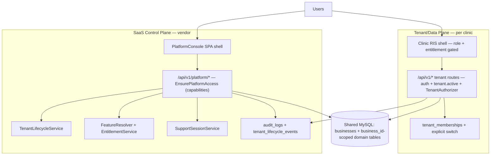

# TARGET_ARCHITECTURE — implemented

## Planes

- **Control plane** — `users.type ∈ {super_admin, platform_admin}`. Operates tenants, plans, subscriptions, entitlements, usage, support sessions, audit. `GET /bootstrap` returns a metadata-only platform payload (never clinical records). Patient PHI is listed nowhere in platform payloads; tenant 360 exposes operational metadata (counts, users' names/emails/roles, facilities, lifecycle, audit).
- **Data plane** — tenant staff (`admin`, `staff`) and patient users. Every tenant route is: authentication → `tenant.active` availability gate → controller permission check via `TenantAuthorizer` (tenant-scoped) → `business_id`-scoped queries.

## Identity & context

- Global user identity + `tenant_memberships` rows (role = SPA vocabulary, one active default). `POST /api/v1/tenant/switch` re-verifies membership server-side, moves `business_id`/`active_business`, flushes authorization caches, audits.
- Platform staff hold **zero** tenant permissions. A tenant context exists for them **only** inside an active `support_sessions` row (verified server-side via the session `support_context` value — never a client-supplied id).

## Enforcement points (single source per concern)

| Concern | Enforcement | File |
|---|---|---|
| Tenant availability | 402 gate | `EnsureTenantActive` + `Business::isSubscribable()` |
| Tenant permissions | union of the user's roles **belonging to the active tenant** | `TenantAuthorizer` |
| Platform capabilities | `middleware('platform:capability')` | `EnsurePlatformAccess` + `PlatformAuthorizer` |
| Quotas | 403 `quota_exceeded` | `EntitlementService::enforce` (studies, users) |
| Module features | 403 `feature_disabled` | `FeatureResolver` + `denyFeatureUnlessEnabled` (inventory, dicom, dispatch) |
| Audit | every controller action + lifecycle events + support sessions | `AuditLog` (business-attributed) + `TenantLifecycleEvent` |
