# TENANT_LIFECYCLE — states, transitions, guarantees (implemented)

```mermaid
stateDiagram-v2
    [*] --> provisioning : platform provision / public signup
    provisioning --> trialing : bootstrap complete (trial)
    provisioning --> active : bootstrap complete (direct term)
    provisioning --> provisioning : provision-retry (idempotent)
    trialing --> active : platform activate
    trialing --> expired : sweep (trial_ends_at past)
    active --> suspended : platform suspend
    active --> expired : sweep (subscription_ends_at past)
    suspended --> active : platform reactivate
    expired --> active : platform activate (stale term cleared)
    active --> offboarding : platform offboard
    suspended --> offboarding : platform offboard
    offboarding --> terminated : terminate (confirmCode = tenant_code)
    offboarding --> active : reactivate
    terminated --> [*] : ris:tenant-destroy (operator, post-retention)
```

## Behavior per state

| State | Login | Tenant API | Notes |
|---|---|---|---|
| `provisioning` | ✓ (admin exists mid-bootstrap) | 402 | visible to platform; `provision-retry` recovers idempotently |
| `trialing` | ✓ | ✓ until `trial_ends_at` | sweep lapses to `expired` |
| `active` | ✓ | ✓ | term managed via `PATCH` subscription |
| `suspended` | ✓ (gate view) | 402 | data intact; interactive logins revoked (`is_enable_login = 0`) |
| `expired` | ✓ (gate view) | 402 | |
| `offboarding` | blocked (403) | 402 | data export captured to `storage/tenant-exports/`, retention clock starts (`RIS_TERMINATED_RETENTION_DAYS`, default 90) |
| `terminated` | blocked (403) | 402 | support sessions force-closed; destruction only via `ris:tenant-destroy` after retention (explicit `--confirm` + interactive confirmation) |

## Guarantees

- Every transition is **transactional**, appended to `tenant_lifecycle_events`, and audited (`audit_logs.business_id`).
- Provisioning is **idempotent on retry**: `provision-retry` re-runs `TenantBootstrap` (all `updateOrCreate`), re-creates the missing membership, then activates.
- Offboarding/termination **never delete clinical data**; the retention file is an export, destruction is an explicit, operator-only command with double confirmation.
- Public signup (`POST /register`) and platform provisioning both flow through `TenantLifecycleService::provision` — one code path, one audit trail.
